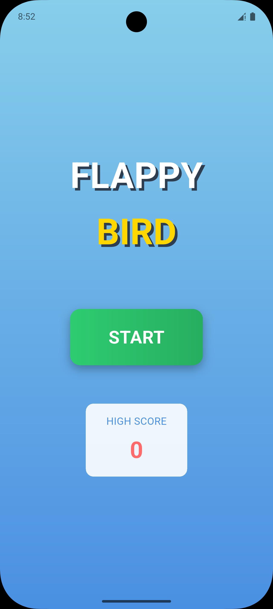
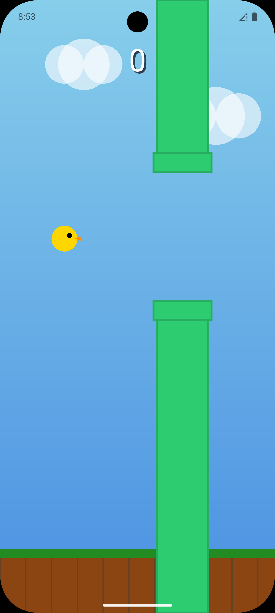
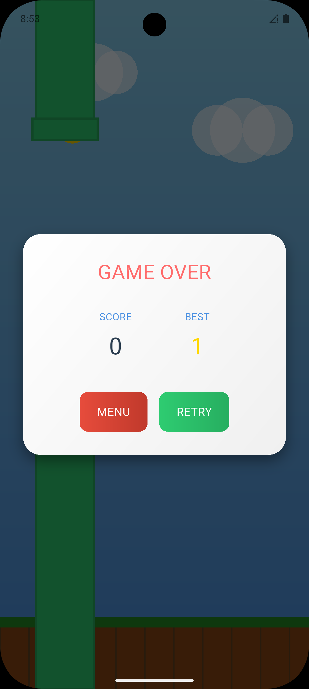

# flame_app

an experimental flappy birb game on flame package

nothing to read here, just build it and play when bored

---

## 🚀 Overview
Flappy Flame is a simple, addictive side-scrolling game where you control a birb and try to dodge pipes for as long as your reflexes allow. This project is a playground for the [Flame](https://flame-engine.org/) game engine in Flutter, and for anyone who just wants to procrastinate productively.

---

## 🎮 Features
- Classic flappy birb gameplay
- Smooth animations and physics
- Score tracking and persistent high score
- Responsive controls for mobile and desktop
- Modular code structure for easy extension
- Cross-platform: Android, iOS, Web, Windows, macOS, Linux

---

## 🛠️ Getting Started

### Prerequisites
- [Flutter SDK](https://flutter.dev/docs/get-started/install)
- [Dart](https://dart.dev/get-dart)
- Compatible IDE (VS Code, Android Studio, etc.)

### Installation
1. **Clone the repository:**
   ```sh
   git clone https://github.com/NiikhilRaj/flappy_flame.git
   cd flappy_flame
   ```
2. **Install dependencies:**
   ```sh
   flutter pub get
   ```
3. **Run the app:**
   - **Android/iOS:**
     ```sh
     flutter run
     ```
   - **Web:**
     ```sh
     flutter run -d chrome
     ```
   - **Windows/macOS/Linux:**
     ```sh
     flutter run -d windows  # or macos/linux
     ```

---

## 📂 Project Structure
```
lib/
  main.dart            # Entry point
  game/                # Game logic and components
  models/              # Data models
  screens/             # UI screens
  services/            # Score and other services
  widgets/             # Custom widgets
android/ios/web/linux/macos/windows/  # Platform-specific files
```

---

## 🖼️ Screenshots

| Home Screen | Gameplay | Scoreboard |
|-------------|----------|-----------|
|  |  |  |

---

## ✨ Credits
- [Flame Engine](https://flame-engine.org/)
- [Flutter](https://flutter.dev/)
- Inspired by the original Flappy Bird

---


## 🤝 Contributing
Pull requests are welcome! For major changes, please open an issue first to discuss what you would like to change.

---

## 📬 Contact
For questions or feedback, open an issue or reach out via [GitHub](https://github.com/NiikhilRaj).
